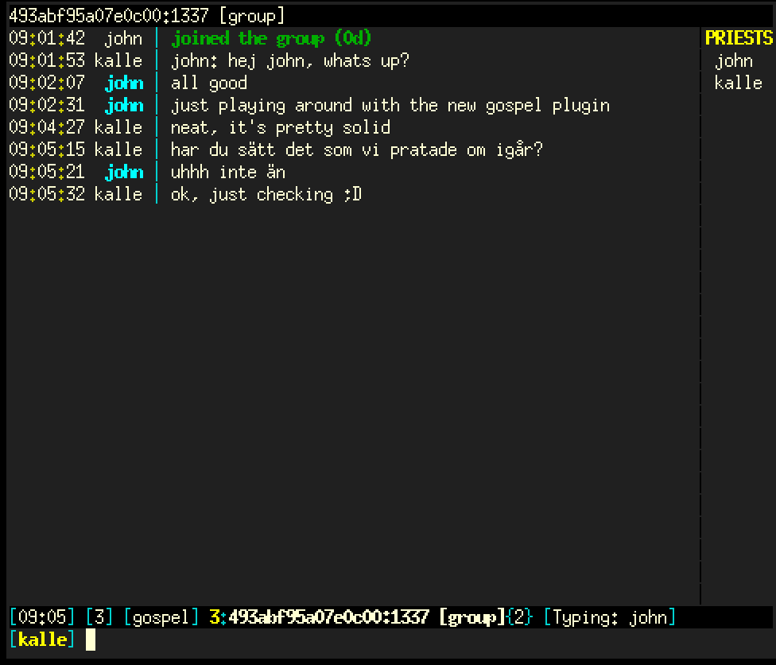

# Gospel

Gospel, a litany plugin for WeeChat.

Litany is an end-to-end encrypted and peer-to-peer chat protocol
using the sanctum protocol as its transport layer.

For details on how the underlying tunnels works see
<a href="https://github.com/jorisvink/sanctum/blob/master/docs/crypto.md">docs/crypto.md</a> in the sanctum repository.



## Features

Litany supports having one-to-one or group conversations. The litany
establishes a sanctum tunnel for each peer in a conversation, meaning
group conversations have multiple active tunnels.

# Building

You need to have weechat and libkyrka installed on your system, the
build also depends on pkg-config.

On MacOS set LIBKYRKA to the dist-build path for your libkyrka build.

```
$ make
```

# Configuration

```
/set plugins.var.gospel.kek-id "kek_id"
/set plugins.var.gospel.identity "cs_id"
/set plugins.var.gospel.flock "flock_id"

/set plugins.var.gospel.cathedral.ip = "x.x.x.x"
/set plugins.var.gospel.cathedral.port = "xxxx"

/set plugins.var.gospel.kek-path "/path/to/read/kek"
/set plugins.var.gospel.cosk-path "/path/to/read/cosk-file"
/set plugins.var.gospel.cs-path "/path/to/read/cathedral-secret"
```

If you wish to use remembrances for your cathedral setup, enable
them by setting the **remembrance-path** configuration option.

```
/set plugins.var.gospel.remembrance-path "/path/to/write/remembrance.cfg"
```

By default WeeChat logs all conversations, you probably don't want
that if you're using this plugin. To disable that either unload
the logger plugin or turn off autologging.

```
/set logger.file.auto_log off
```

Don't forget to /save after setting these.

## Load the plugin

```
/plugin load /path/to/gospel.so
```

# Chatting

```
/command gospel nick yourname
/command gospel chat <flock> <peer>
/command gospel group <flock> <group>
```
